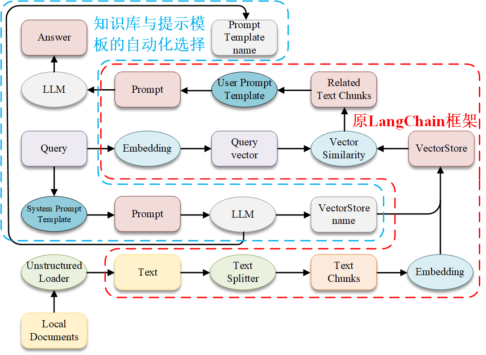
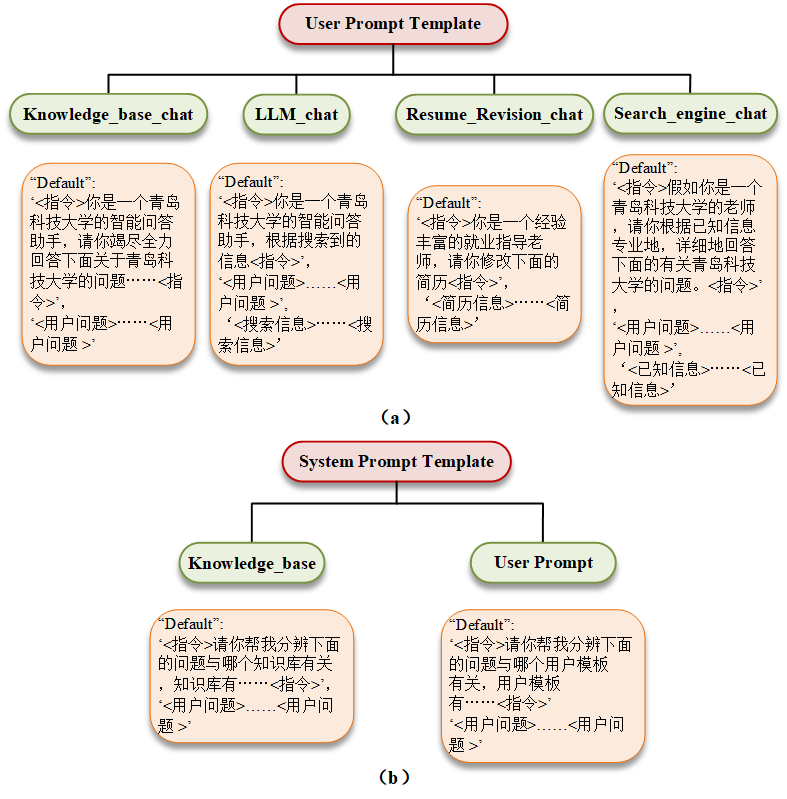
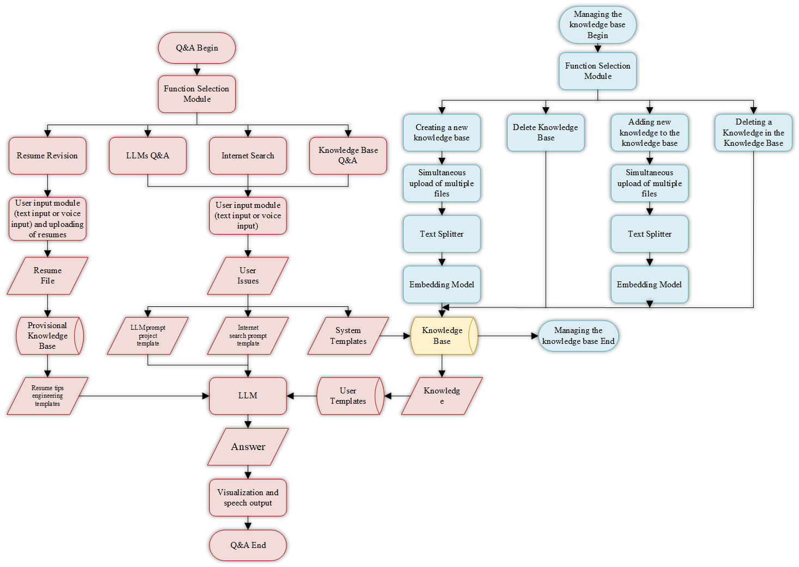
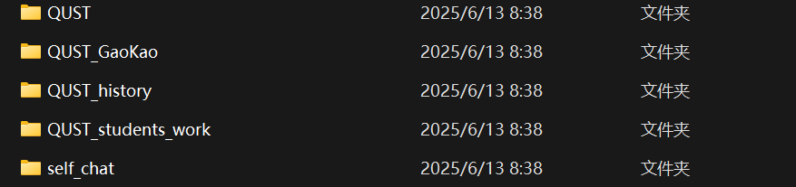

# LLM-Campus_Q-A --Auto-Langchain
这个项目是关于如何给自己的学校做一个简单的校园智能问答系统，基于的是博主的本科毕业论文，此份存档仅留作给母校的学弟学妹们参考学习交流。

该项目是在Langchain-chatchat0.2X的基础上做了一些改进，原项目地址：https://github.com/chatchat-space/Langchain-Chatchat/tree/v0.2.10。
在此鸣谢！！

## 改进
### 知识库和提示模板的自动匹配机制

传统LangChain框架存在显著局限性：其依赖人工筛选知识库与提示模板，需要用户反复手动调试两者配置。由于缺乏明确的引导机制，用户往往难以知晓各知识库的具体知识范畴，也难以判断对应提示模板的适用场景，导致使用效率较低。

针对上述问题，本研究提出了全新的智能框架——Auto-Langchain。该框架在原LangChain框架外部增设了知识库与提示模板的自动选择机制，具体架构如图所示。其核心流程如下：首先，将用户问题嵌入系统模板并发送至LLM；其次，依据LLM返回的知识库及用户模板名称，切换至对应的知识库与用户模板；最后，通过原LangChain框架将用户问题与匹配的相关知识嵌入用户模板，再次发送至LLM以获取最终答案，从而实现了知识库与提示模板的自动匹配。

在文本处理方面，传统LangChain采用基于上下文语义的分割器（Splitter）来形成Text Chunks，这种方式在处理通用性非结构化数据时具有一定优势，但在回答精度要求很高的场景（如党务党建问答场景）中，存在明显弊端。为此，本系统创新性地采用基于Markdown的文本分割器来形成Text Chunks，以更好地满足高精度场景的需求。
### 提示工程模板
Auto-LangChain框架的提示工程模板包含用户模板与系统模板两大类型：

（1）用户模板（User Prompt Template）：
用户模板是用户提问时，将问题内容、匹配问题的相关知识及对应指令进行整合的提示模板，根据不同的问答功能可细分为：Knowledge_base_chat（基于知识库的问答）、LLM_chat（仅根据大语言模型自身功能回答）、Resume_Revision_chat（简历修改）、Search_engine_chat（联网回答）这四种提示模板。具体结构如图（a）。

（2）系统模板（System Prompt Template）：
系统模板旨在实现不同知识库与用户模板的自动化选择，其作用是将用户问题与各知识库的核心内容及相关指令进行整合。具体结构如图（b）。

## 系统整体框架

## 文件目录
### developing: 管理端UI
### knowledge_base：知识库存放位置，管理端对该位置的知识库进行增删改查，用户端可以访问，但是没有修改的权限
### students：学生端UI
## 快速运行
相关python环境配置在requirements.txt中，建议采用Python3.11。

### 配置环境指令：
`pip install -r requirements.txt`,最好加入清华源镜像，下载更快。
### 配置Embedding
从 https://huggingface.co/BAAI/bge-m3 中将bgm-m3下载到本地（用终端下载），并修改/developing/configs/model_config.py和中/students/configs/model_config.py的bge-m3模型的路径配置。

### 配置知识库
知识库中没有任何文件，需要自己加入。

`cd \developing`

`python startup.py -a`

打开知识库管理进行添加知识库，博主在做毕设时，设置的知识库的名字为：

如果参考博主的知识库的名称的话，需要修改/students/configs/prompt_config.py中对应的内容。
### 运行用户端：
`cd \students`

`python startup.py -a`
## Demo
### LLM问答
<video width="900" height="500" controls="controls">
    <source src="video.mp4" type="video/mp4">
</video>

### 知识库问答
<video width="900" height="500" controls="controls">
    <source src="video1.mp4" type="video/mp4">
</video>

### 简历修改
<video width="900" height="500" controls="controls">
    <source src="video2.mp4" type="video/mp4">
</video>

### 联网搜索
<video width="900" height="500" controls="controls">
    <source src="video3.mp4" type="video/mp4">
</video>